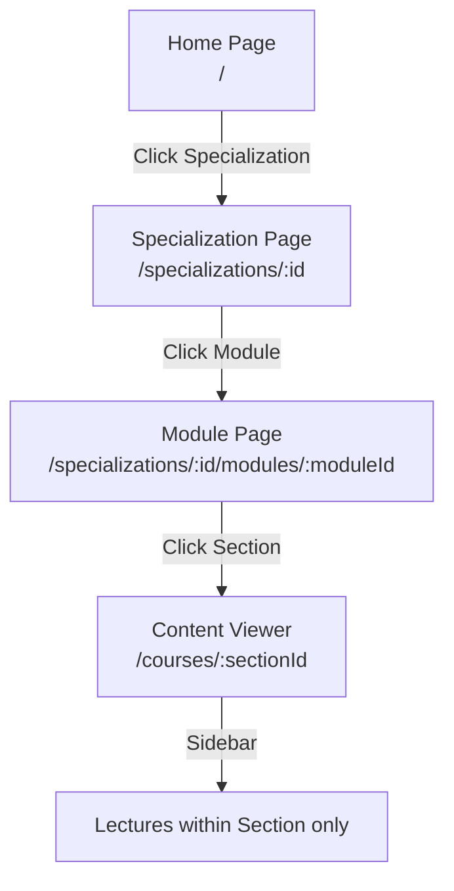
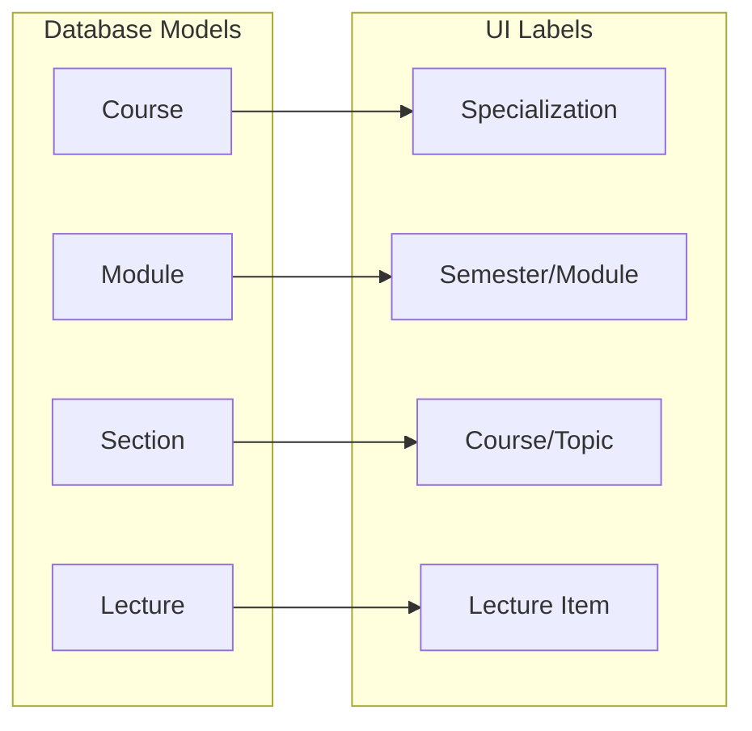
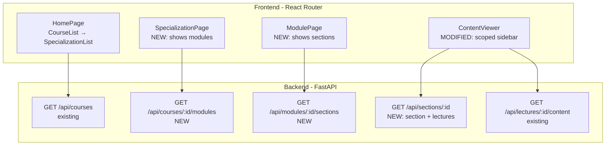
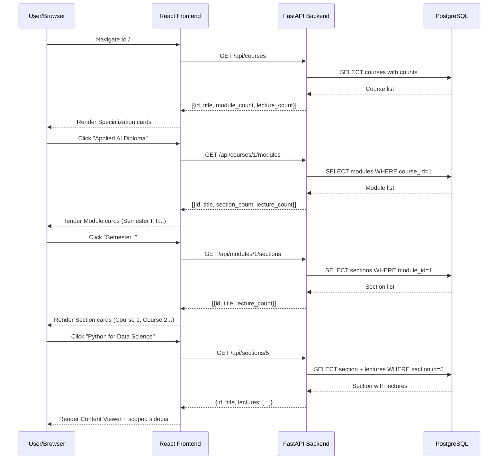
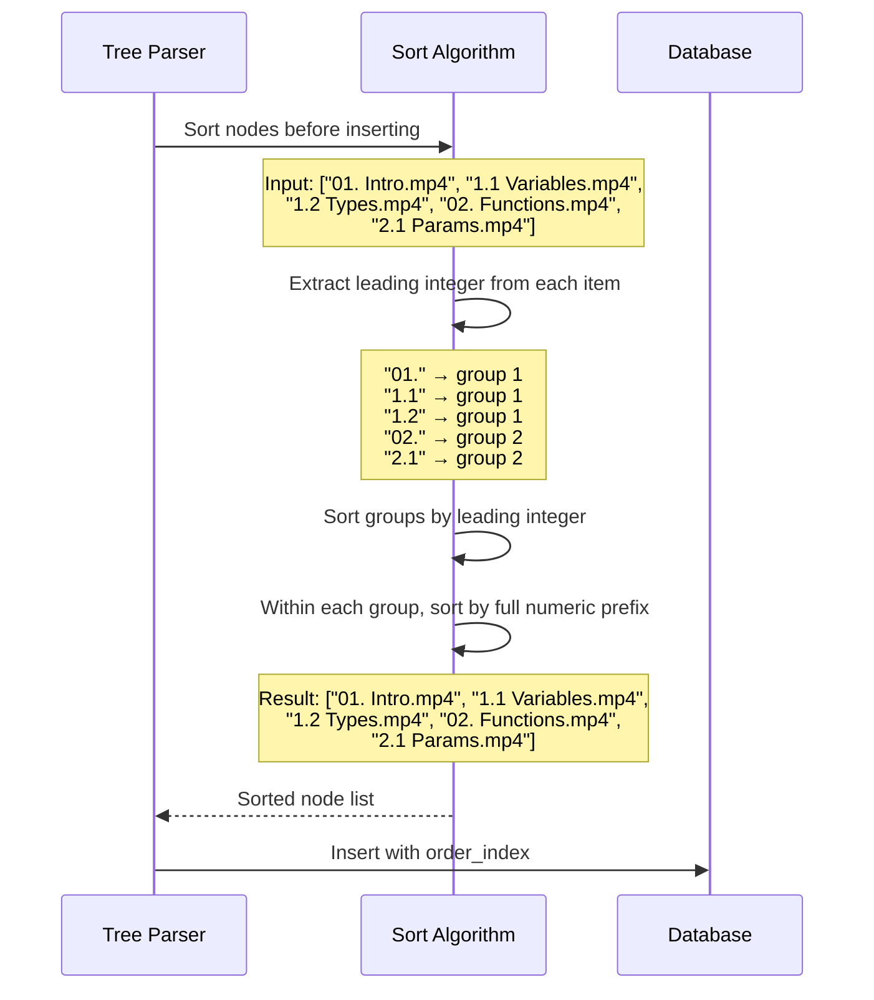

# Design Document: Course Navigation Restructure

## Overview

This feature restructures the learning platform's navigation from a flat two-level pattern (course list → course detail with full sidebar) into a multi-level drill-down experience. Users will navigate through Specializations → Modules (Semesters) → Sections (Courses/Topics) → Content Viewer with a scoped sidebar showing only the current section's lectures.

Additionally, the lecture sort algorithm is updated to group items by their leading integer prefix rather than performing a pure natural sort. Items sharing the same leading number (e.g., `01.`, `1.1`, `1.anything`) form a group, and groups are ordered sequentially. Within each group, items are sorted by their full numeric prefix.

The existing database schema (Course → Module → Section → Lecture) remains unchanged. Only the frontend routing/pages and the backend sort algorithm change, with two new backend endpoints added to support the drill-down navigation.

## Architecture

### Navigation Flow Architecture



### Data Model to UI Terminology Mapping



### System Architecture (Unchanged Backend, New Endpoints)



## Sequence Diagrams

### Drill-Down Navigation Flow



### Lecture Sort Grouping Flow



## Components and Interfaces

### Component 1: New Backend Endpoints (FastAPI Router)

**Purpose**: Provide granular data fetching for each navigation level instead of loading the entire course tree at once.

**Interface**:
```python
# backend/app/routers/courses.py (additions)

@router.get("/courses/{course_id}/modules")
async def list_modules_for_course(
    course_id: int,
    session: AsyncSession = Depends(get_session),
) -> list[ModuleListResponse]:
    """Return modules for a course with section/lecture counts."""
    ...

@router.get("/modules/{module_id}/sections")
async def list_sections_for_module(
    module_id: int,
    session: AsyncSession = Depends(get_session),
) -> list[SectionListResponse]:
    """Return sections for a module with lecture counts."""
    ...

@router.get("/sections/{section_id}")
async def get_section_detail(
    section_id: int,
    session: AsyncSession = Depends(get_session),
) -> SectionDetailResponse:
    """Return a section with its lectures (for the content viewer)."""
    ...
```

**Responsibilities**:
- Serve module lists scoped to a specific course
- Serve section lists scoped to a specific module
- Serve section detail with lectures for the content viewer
- Include counts (section_count, lecture_count) for navigation cards
- Return 404 if parent entity does not exist

### Component 2: Updated Frontend Router (React Router)

**Purpose**: Define the new multi-level route hierarchy replacing the flat course list → detail pattern.

**Interface**:
```typescript
// frontend/src/App.tsx (updated routes)
<Routes>
  <Route path="/" element={<SpecializationList />} />
  <Route path="/specializations/:courseId" element={<SpecializationDetail />} />
  <Route path="/specializations/:courseId/modules/:moduleId" element={<ModuleDetail />} />
  <Route path="/courses/:sectionId" element={<SectionViewer />} />
</Routes>
```

**Responsibilities**:
- Map URL paths to the correct page components
- Pass route params to components for data fetching
- Maintain breadcrumb context across navigation levels

### Component 3: SpecializationList Page (Replaces CourseList)

**Purpose**: Displays all specializations (DB: courses) as the home page.

**Interface**:
```typescript
// Reuses existing GET /api/courses endpoint
// Renders cards with title, description, module_count, lecture_count
// Links to /specializations/:courseId
export function SpecializationList(): JSX.Element;
```

**Responsibilities**:
- Fetch course list from existing endpoint
- Render specialization cards with counts and progress
- Link to specialization detail page

### Component 4: SpecializationDetail Page (NEW)

**Purpose**: Shows modules (semesters) for a given specialization (course).

**Interface**:
```typescript
// Fetches GET /api/courses/:courseId/modules
// Renders module cards with section_count, lecture_count
// Links to /specializations/:courseId/modules/:moduleId
export function SpecializationDetail(): JSX.Element;
```

**Responsibilities**:
- Fetch modules for the selected course
- Display module cards with counts
- Show breadcrumb: Home > Specialization Name
- Handle loading/error states

### Component 5: ModuleDetail Page (NEW)

**Purpose**: Shows sections (courses/topics) within a module (semester).

**Interface**:
```typescript
// Fetches GET /api/modules/:moduleId/sections
// Renders section cards with lecture_count
// Links to /courses/:sectionId
export function ModuleDetail(): JSX.Element;
```

**Responsibilities**:
- Fetch sections for the selected module
- Display section cards with lecture counts
- Show breadcrumb: Home > Specialization > Module
- Handle loading/error states

### Component 6: SectionViewer Page (Replaces CourseDetail)

**Purpose**: Content viewer with a sidebar showing ONLY lectures from the current section.

**Interface**:
```typescript
// Fetches GET /api/sections/:sectionId
// Renders sidebar with section's lectures only (no modules/sections tree)
// Renders content viewer for active lecture
export function SectionViewer(): JSX.Element;
```

**Responsibilities**:
- Fetch section detail with lectures
- Render flat sidebar with only lectures from THIS section
- Support next/prev navigation within section
- Maintain progress tracking per lecture
- Support last-viewed restoration within section

### Component 7: Grouped Sort Algorithm (Replaces _natural_sort_key)

**Purpose**: Sort lecture/node items by leading integer group, then by full numeric prefix within the group.

**Interface**:
```python
def _grouped_sort_key(node: ParsedNode) -> tuple[int, list]:
    """Sort key that groups items by leading integer, then by sub-number."""
    ...
```

**Responsibilities**:
- Extract the leading integer from the item's name (e.g., "01" → 1, "1.1" → 1, "2.3" → 2)
- Group items sharing the same leading integer together
- Within a group, sort by the full numeric prefix (e.g., 1.0 < 1.1 < 1.2)
- Handle edge cases: items with no numeric prefix sort last

## Data Models

### New Response Schemas

```python
# backend/app/schemas/course.py (additions)

class ModuleListResponse(BaseModel):
    """Module card in the specialization detail page."""
    id: int
    title: str
    order: int
    section_count: int
    lecture_count: int

class SectionListResponse(BaseModel):
    """Section card in the module detail page."""
    id: int
    title: str
    order: int
    lecture_count: int

class SectionDetailResponse(BaseModel):
    """Section with lectures for the content viewer."""
    id: int
    title: str
    module_id: int
    module_title: str
    course_id: int
    course_title: str
    lectures: list[LectureResponse]
```

### New Frontend Types

```typescript
// frontend/src/types/index.ts (additions)

/** Module card for specialization detail page. */
export interface ModuleListItem {
  id: number;
  title: string;
  order: number;
  section_count: number;
  lecture_count: number;
}

/** Section card for module detail page. */
export interface SectionListItem {
  id: number;
  title: string;
  order: number;
  lecture_count: number;
}

/** Section detail for content viewer. */
export interface SectionDetail {
  id: number;
  title: string;
  module_id: number;
  module_title: string;
  course_id: number;
  course_title: string;
  lectures: Lecture[];
}
```

**Validation Rules**:
- `section_count` and `lecture_count` are always >= 0
- `lectures` array in SectionDetailResponse is ordered by `order_index`
- `module_id` and `course_id` provide context for breadcrumb navigation
- All ID fields reference existing database records

## Algorithmic Pseudocode

### Grouped Sort Algorithm

```python
import re
from dataclasses import dataclass

def _extract_leading_integer(name: str) -> int | None:
    """
    Extract the leading integer from a filename/title.
    
    Examples:
        "01. Introduction" → 1
        "1.1 Variables" → 1
        "1.2.3 Deep Topic" → 1
        "2.1 Functions" → 2
        "02. Chapter Two" → 2
        "No number here" → None
    """
    match = re.match(r'^0*(\d+)', name)
    if match:
        return int(match.group(1))
    return None


def _extract_full_numeric_prefix(name: str) -> list[int]:
    """
    Extract all numeric components from the prefix of a name.
    
    Examples:
        "01. Introduction" → [1]
        "1.1 Variables" → [1, 1]
        "1.2.3 Deep Topic" → [1, 2, 3]
        "02. Chapter" → [2]
        "No number" → []
    """
    match = re.match(r'^([\d.]+)', name)
    if not match:
        return []
    prefix = match.group(1).rstrip('.')
    parts = prefix.split('.')
    return [int(p) for p in parts if p]


def _grouped_sort_key(node: "ParsedNode") -> tuple[int, list[int], str]:
    """
    ALGORITHM: Grouped Sort Key
    INPUT: node with a name field
    OUTPUT: tuple (leading_group, sub_numbers, lowercase_name)
    
    Sort priority:
      1. Primary: leading integer group (items share group if same leading int)
      2. Secondary: full numeric prefix as list of ints
      3. Tertiary: alphabetical name (fallback)
    
    Items without a numeric prefix get group = infinity (sort last).
    """
    leading = _extract_leading_integer(node.name)
    full_prefix = _extract_full_numeric_prefix(node.name)
    
    if leading is None:
        # No numeric prefix → sort after all numbered items
        return (999999, [], node.name.lower())
    
    return (leading, full_prefix, node.name.lower())
```

**Preconditions:**
- `node.name` is a non-empty string
- Name may or may not start with a numeric prefix

**Postconditions:**
- Items with the same leading integer are adjacent in sorted output
- Within a group, items are ordered by their full numeric prefix (1.0 < 1.1 < 1.2)
- Items without numeric prefix appear last
- Sort is stable for items with identical sort keys

**Loop Invariants:** N/A (no loops in key extraction)

### Sort Behavior Examples

```
Input (current broken order):
  "01. Introduction to Python.mp4"
  "02. Data Types.mp4"
  "03. Control Flow.mp4"
  "1.1 Variables and Assignment.mp4"
  "1.2 String Operations.mp4"
  "2.1 Lists and Tuples.mp4"
  "2.2 Dictionaries.mp4"

Output (desired grouped order):
  "01. Introduction to Python.mp4"    # group 1, prefix [1]
  "1.1 Variables and Assignment.mp4"  # group 1, prefix [1, 1]
  "1.2 String Operations.mp4"        # group 1, prefix [1, 2]
  "02. Data Types.mp4"               # group 2, prefix [2]
  "2.1 Lists and Tuples.mp4"         # group 2, prefix [2, 1]
  "2.2 Dictionaries.mp4"             # group 2, prefix [2, 2]
  "03. Control Flow.mp4"             # group 3, prefix [3]
```

### Backend Endpoint: List Modules for Course

```python
async def list_modules_for_course(
    course_id: int,
    session: AsyncSession,
) -> list[ModuleListResponse]:
    """
    ALGORITHM: Fetch modules with aggregate counts
    INPUT: course_id (int)
    OUTPUT: list of modules with section_count and lecture_count
    
    PRECONDITION: course_id exists in courses table
    POSTCONDITION: Returns all modules for the course, ordered by order_index
    """
    # Verify course exists
    course = await session.get(Course, course_id)
    if course is None:
        raise HTTPException(404, f"Course {course_id} not found")
    
    # Query modules with counts
    result = await session.execute(
        select(
            Module,
            func.count(distinct(Section.id)).label("section_count"),
            func.count(Lecture.id).label("lecture_count"),
        )
        .where(Module.course_id == course_id)
        .outerjoin(Section, Section.module_id == Module.id)
        .outerjoin(Lecture, Lecture.section_id == Section.id)
        .group_by(Module.id)
        .order_by(Module.order_index)
    )
    
    return [
        ModuleListResponse(
            id=row.Module.id,
            title=row.Module.title,
            order=row.Module.order_index,
            section_count=row.section_count,
            lecture_count=row.lecture_count,
        )
        for row in result.all()
    ]
```

### Backend Endpoint: List Sections for Module

```python
async def list_sections_for_module(
    module_id: int,
    session: AsyncSession,
) -> list[SectionListResponse]:
    """
    ALGORITHM: Fetch sections with lecture counts
    INPUT: module_id (int)
    OUTPUT: list of sections with lecture_count
    
    PRECONDITION: module_id exists in modules table
    POSTCONDITION: Returns all sections for the module, ordered by order_index
    """
    # Verify module exists
    module = await session.get(Module, module_id)
    if module is None:
        raise HTTPException(404, f"Module {module_id} not found")
    
    result = await session.execute(
        select(
            Section,
            func.count(Lecture.id).label("lecture_count"),
        )
        .where(Section.module_id == module_id)
        .outerjoin(Lecture, Lecture.section_id == Section.id)
        .group_by(Section.id)
        .order_by(Section.order_index)
    )
    
    return [
        SectionListResponse(
            id=row.Section.id,
            title=row.Section.title,
            order=row.Section.order_index,
            lecture_count=row.lecture_count,
        )
        for row in result.all()
    ]
```

### Backend Endpoint: Get Section Detail

```python
async def get_section_detail(
    section_id: int,
    session: AsyncSession,
) -> SectionDetailResponse:
    """
    ALGORITHM: Fetch section with lectures and parent context
    INPUT: section_id (int)
    OUTPUT: section with lectures and breadcrumb data
    
    PRECONDITION: section_id exists in sections table
    POSTCONDITION: Returns section with ordered lectures + parent module/course info
    """
    result = await session.execute(
        select(Section)
        .where(Section.id == section_id)
        .options(
            selectinload(Section.lectures),
            selectinload(Section.module).selectinload(Module.course),
        )
    )
    section = result.scalar_one_or_none()
    
    if section is None:
        raise HTTPException(404, f"Section {section_id} not found")
    
    return SectionDetailResponse(
        id=section.id,
        title=section.title,
        module_id=section.module.id,
        module_title=section.module.title,
        course_id=section.module.course.id,
        course_title=section.module.course.title,
        lectures=[
            LectureResponse(
                id=lec.id,
                title=lec.title,
                order=lec.order_index,
                content_type=lec.content_type,
                file_path=lec.file_path,
                colab_url=None,
                duration_seconds=lec.duration_seconds,
            )
            for lec in sorted(section.lectures, key=lambda l: l.order_index)
        ],
    )
```

## Key Functions with Formal Specifications

### Function 1: _grouped_sort_key()

```python
def _grouped_sort_key(node: ParsedNode) -> tuple[int, list[int], str]:
```

**Preconditions:**
- `node` is a valid `ParsedNode` with a non-empty `name` field
- `node.name` is a UTF-8 string

**Postconditions:**
- Returns a 3-tuple that Python's default tuple comparison uses for ordering
- First element (leading group): integer extracted from leading digits, or 999999 if no digits
- Second element (sub-numbers): list of all numeric prefix components as integers
- Third element (name): lowercase name as tiebreaker
- For any two nodes A and B: if A's leading integer < B's leading integer, A sorts before B
- For any two nodes A and B in the same group: full prefix comparison determines order

**Loop Invariants:** N/A

### Function 2: _extract_leading_integer()

```python
def _extract_leading_integer(name: str) -> int | None:
```

**Preconditions:**
- `name` is a non-empty string

**Postconditions:**
- Returns an integer if `name` starts with one or more digits (possibly with leading zeros)
- Leading zeros are stripped: "01" → 1, "001" → 1
- Returns None if `name` does not start with a digit
- "01. Foo" → 1, "1.1 Bar" → 1, "10.2 Baz" → 10, "abc" → None

**Loop Invariants:** N/A

### Function 3: _extract_full_numeric_prefix()

```python
def _extract_full_numeric_prefix(name: str) -> list[int]:
```

**Preconditions:**
- `name` is a non-empty string

**Postconditions:**
- Returns empty list if name doesn't start with digits
- Returns list of integers parsed from dot-separated prefix
- "1.2.3 Foo" → [1, 2, 3]
- "01. Bar" → [1]
- "1.1 Baz" → [1, 1]
- Trailing dots are ignored: "1." → [1]
- Pure digits work: "42 item" → [42]

**Loop Invariants:** N/A

### Function 4: list_modules_for_course()

```python
async def list_modules_for_course(course_id: int, session: AsyncSession) -> list[ModuleListResponse]:
```

**Preconditions:**
- `course_id` is a positive integer
- `session` is a valid async database session

**Postconditions:**
- Raises HTTP 404 if `course_id` doesn't exist in courses table
- Returns list of all modules belonging to the course
- Each module includes accurate `section_count` and `lecture_count`
- Results are ordered by `Module.order_index` ascending
- Empty list returned for courses with no modules (shouldn't happen but is safe)

**Loop Invariants:** N/A

### Function 5: get_section_detail()

```python
async def get_section_detail(section_id: int, session: AsyncSession) -> SectionDetailResponse:
```

**Preconditions:**
- `section_id` is a positive integer
- `session` is a valid async database session

**Postconditions:**
- Raises HTTP 404 if `section_id` doesn't exist in sections table
- Returns section with all its lectures ordered by `order_index`
- Includes parent `module_id`, `module_title`, `course_id`, `course_title` for breadcrumbs
- `lectures` list contains ONLY lectures from this specific section
- Lectures are sorted by `order_index` ascending

**Loop Invariants:** N/A

## Example Usage

### Frontend: New API Client Functions

```typescript
// frontend/src/api/client.ts (additions)

import type { ModuleListItem, SectionListItem, SectionDetail } from "../types";

/** Fetch modules for a specialization (course). */
export function getModulesForCourse(courseId: number): Promise<ModuleListItem[]> {
  return fetchJson<ModuleListItem[]>(`/api/courses/${courseId}/modules`);
}

/** Fetch sections for a module. */
export function getSectionsForModule(moduleId: number): Promise<SectionListItem[]> {
  return fetchJson<SectionListItem[]>(`/api/modules/${moduleId}/sections`);
}

/** Fetch section detail with lectures for the content viewer. */
export function getSectionDetail(sectionId: number): Promise<SectionDetail> {
  return fetchJson<SectionDetail>(`/api/sections/${sectionId}`);
}
```

### Frontend: SpecializationDetail Page

```typescript
// frontend/src/pages/SpecializationDetail.tsx
import { useParams, Link } from "react-router-dom";
import { useQuery } from "@tanstack/react-query";
import { getModulesForCourse, getCourses } from "../api/client";

export function SpecializationDetail() {
  const { courseId } = useParams<{ courseId: string }>();
  const id = Number(courseId);
  
  const { data: modules, isLoading } = useQuery({
    queryKey: ["modules", id],
    queryFn: () => getModulesForCourse(id),
  });

  return (
    <div className="max-w-6xl mx-auto px-4 py-8">
      {/* Breadcrumb */}
      <nav className="mb-6 text-sm text-gray-500">
        <Link to="/" className="hover:text-indigo-600">Home</Link>
        <span className="mx-2">›</span>
        <span className="text-gray-900">Specialization Name</span>
      </nav>
      
      <h1 className="text-3xl font-bold mb-8">Modules</h1>
      
      <div className="grid gap-6 md:grid-cols-2 lg:grid-cols-3">
        {modules?.map((mod) => (
          <Link
            key={mod.id}
            to={`/specializations/${courseId}/modules/${mod.id}`}
            className="block bg-white rounded-lg shadow-sm border p-6 hover:shadow-md"
          >
            <h2 className="text-xl font-semibold mb-2">{mod.title}</h2>
            <div className="flex gap-4 text-sm text-gray-500">
              <span>{mod.section_count} courses</span>
              <span>{mod.lecture_count} lectures</span>
            </div>
          </Link>
        ))}
      </div>
    </div>
  );
}
```

### Frontend: SectionViewer Page (Scoped Sidebar)

```typescript
// frontend/src/pages/SectionViewer.tsx
import { useState, useMemo, useCallback } from "react";
import { useParams, Link } from "react-router-dom";
import { useQuery } from "@tanstack/react-query";
import { getSectionDetail } from "../api/client";
import { ContentViewer } from "../components/ContentViewer";
import type { Lecture } from "../types";

export function SectionViewer() {
  const { sectionId } = useParams<{ sectionId: string }>();
  const id = Number(sectionId);
  
  const { data: section, isLoading } = useQuery({
    queryKey: ["section", id],
    queryFn: () => getSectionDetail(id),
  });
  
  const [activeLecture, setActiveLecture] = useState<Lecture | null>(null);
  
  // Only lectures from THIS section
  const lectures = useMemo(() => section?.lectures ?? [], [section]);

  return (
    <div className="flex h-[calc(100vh-64px)]">
      {/* Scoped sidebar - only this section's lectures */}
      <aside className="w-80 border-r bg-white overflow-y-auto">
        <div className="p-4">
          <h2 className="font-semibold text-gray-800 mb-3">{section?.title}</h2>
          <ul>
            {lectures.map((lecture) => (
              <li key={lecture.id}>
                <button
                  onClick={() => setActiveLecture(lecture)}
                  className={`w-full text-left text-sm py-2 px-3 rounded ${
                    activeLecture?.id === lecture.id
                      ? "bg-indigo-100 text-indigo-800"
                      : "text-gray-600 hover:bg-gray-50"
                  }`}
                >
                  {lecture.title}
                </button>
              </li>
            ))}
          </ul>
        </div>
      </aside>
      
      {/* Content area */}
      <main className="flex-1 overflow-auto bg-gray-50">
        {activeLecture ? (
          <ContentViewer lecture={activeLecture} /* ... */ />
        ) : (
          <div className="flex items-center justify-center h-full">
            <p>Select a lecture to begin.</p>
          </div>
        )}
      </main>
    </div>
  );
}
```

### Backend: Updated Sort in Tree Parser

```python
# backend/app/services/tree_parser.py (replacement for _natural_sort_key)

import re
from app.services.tree_parser import ParsedNode


def _extract_leading_integer(name: str) -> int | None:
    """Extract the leading integer, stripping leading zeros."""
    match = re.match(r'^0*(\d+)', name)
    return int(match.group(1)) if match else None


def _extract_full_numeric_prefix(name: str) -> list[int]:
    """Extract all dot-separated numeric components from the prefix."""
    match = re.match(r'^([\d.]+)', name)
    if not match:
        return []
    prefix = match.group(1).rstrip('.')
    parts = prefix.split('.')
    return [int(p) for p in parts if p]


def _grouped_sort_key(node: ParsedNode) -> tuple[int, list[int], str]:
    """Generate a sort key that groups items by leading integer."""
    leading = _extract_leading_integer(node.name)
    full_prefix = _extract_full_numeric_prefix(node.name)
    
    if leading is None:
        return (999999, [], node.name.lower())
    
    return (leading, full_prefix, node.name.lower())
```

## Correctness Properties

### Property 1: Group Adjacency

*For any* list of items sorted by `_grouped_sort_key`, if items A and B share the same leading integer, then *all* items between A and B in the sorted output also share that leading integer. No item from a different group can appear between members of the same group.

**Validates: Lecture sort order fix — grouping requirement**

### Property 2: Group Ordering

*For any* two groups G1 and G2 in the sorted output where G1's leading integer < G2's leading integer, *all* items in G1 appear before *all* items in G2.

**Validates: Lecture sort order fix — group sequence requirement**

### Property 3: Intra-Group Ordering

*For any* two items A and B within the same leading integer group, if A's full numeric prefix is lexicographically less than B's full numeric prefix (comparing element-by-element as integers), then A appears before B in the sorted output.

**Validates: Lecture sort order fix — within-group ordering**

### Property 4: Section Scoping

*For any* request to `GET /api/sections/{id}`, the returned `lectures` array contains ONLY lectures whose `section_id` equals the requested section ID. No lectures from other sections are included.

**Validates: Navigation restructure — scoped sidebar requirement**

### Property 5: Breadcrumb Consistency

*For any* `SectionDetailResponse` returned by the API, the `module_id` and `course_id` fields correctly reference the actual parent module and grandparent course of the section in the database. The navigation path Home → `/specializations/{course_id}` → `/specializations/{course_id}/modules/{module_id}` → `/courses/{section_id}` is always valid.

**Validates: Navigation restructure — drill-down consistency**

### Property 6: Count Accuracy

*For any* `ModuleListResponse` returned by `GET /api/courses/{id}/modules`, the `section_count` equals the actual number of section records with `module_id` matching this module, and `lecture_count` equals the actual number of lecture records nested under this module's sections.

**Validates: Navigation restructure — card count accuracy**

### Property 7: Leading Integer Extraction Correctness

*For any* string starting with digits (possibly zero-padded), `_extract_leading_integer` returns the numeric value with leading zeros stripped. "01" → 1, "1.1" → 1, "10" → 10, "001" → 1. For strings not starting with a digit, it returns None.

**Validates: Sort algorithm — correct group assignment**

## Error Handling

### Error Scenario 1: Invalid Course ID in Navigation

**Condition**: User navigates to `/specializations/999` where course ID 999 doesn't exist
**Response**: Backend returns HTTP 404 with `{"detail": "Course 999 not found"}`
**Recovery**: Frontend displays error message with link back to home page

### Error Scenario 2: Invalid Module ID in Navigation

**Condition**: User navigates to `/specializations/1/modules/999` where module 999 doesn't exist
**Response**: Backend returns HTTP 404 with `{"detail": "Module 999 not found"}`
**Recovery**: Frontend displays error message with link back to specialization page

### Error Scenario 3: Invalid Section ID in Content Viewer

**Condition**: User navigates to `/courses/999` where section ID 999 doesn't exist
**Response**: Backend returns HTTP 404 with `{"detail": "Section 999 not found"}`
**Recovery**: Frontend displays error message with link back to home page

### Error Scenario 4: Module Belongs to Different Course

**Condition**: User navigates to `/specializations/1/modules/5` but module 5 belongs to course 2
**Response**: Backend returns the module data regardless (module endpoint only needs module_id). Frontend breadcrumb uses the course_id from the URL.
**Recovery**: Not a critical error — data is still correct. Breadcrumb may show stale course name if URL is manually crafted.

### Error Scenario 5: Items Without Numeric Prefix in Sort

**Condition**: A lecture filename doesn't start with a number (e.g., "Readme.txt")
**Response**: Sort algorithm assigns group 999999, placing it after all numbered items
**Recovery**: No recovery needed — items sort deterministically to the end

## Testing Strategy

### Unit Testing Approach

**Sort Algorithm Tests** (highest priority):
- Test `_extract_leading_integer` with various inputs (zero-padded, multi-digit, no prefix)
- Test `_extract_full_numeric_prefix` with dot-separated versions
- Test `_grouped_sort_key` produces correct ordering for the documented examples
- Test edge cases: empty strings, all-text names, single digits, deeply nested prefixes

**Endpoint Tests**:
- Test `list_modules_for_course` returns correct counts
- Test `list_sections_for_module` returns correct lecture counts
- Test `get_section_detail` returns only lectures from that section
- Test 404 responses for invalid IDs

### Property-Based Testing Approach

**Property Test Library**: hypothesis (Python)

**Key Properties to Test**:
1. **Group adjacency**: Generate random lists of numbered filenames → sort → verify no interleaving
2. **Group ordering**: Generate items → sort → verify groups appear in ascending order
3. **Idempotency**: Sorting an already-sorted list produces the same result
4. **Leading integer extraction**: For any string of form `f"{n:0{w}d}"` where n > 0, extraction returns n

### Integration Testing Approach

- Test full drill-down flow: create a course with known structure → fetch at each level → verify counts match
- Test that re-seeding with new sort produces correct `order_index` values in DB
- Test frontend routing with React Testing Library: verify correct components render at each route

## Performance Considerations

- **Lazy loading**: Each navigation level fetches only the data it needs, avoiding the current pattern of loading the entire course tree (modules + sections + lectures) in one request
- **Reduced payload**: The content viewer now loads only one section's lectures instead of all lectures for the entire course
- **Database queries**: New endpoints use simple indexed queries (course_id, module_id, section_id are all indexed via foreign key constraints)
- **No N+1**: Counts are computed via GROUP BY aggregates in a single query, not by loading all children

## Security Considerations

- **Path traversal**: No changes needed — file_path security is handled by existing `path_security.py` module
- **Authorization**: No auth in current system — these are read-only public endpoints
- **Input validation**: All ID parameters are validated as integers by FastAPI's path parameter typing

## Dependencies

### Backend (no new dependencies)
- FastAPI (existing)
- SQLAlchemy (existing)
- PostgreSQL (existing)
- Python `re` module (stdlib, for sort algorithm)

### Frontend (no new dependencies)
- React Router (existing) — add new route definitions
- TanStack Query (existing) — add new query hooks
- TailwindCSS (existing) — style new page components
