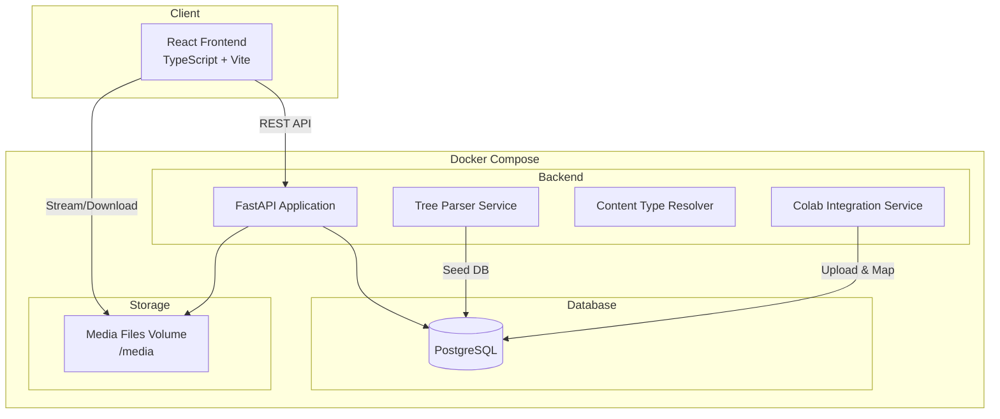
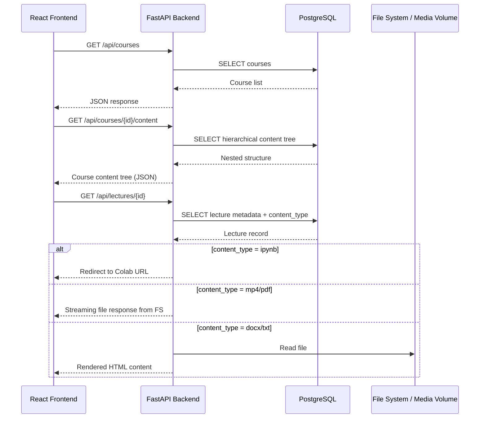
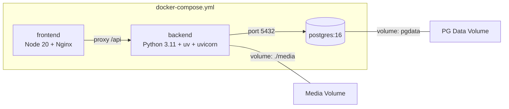
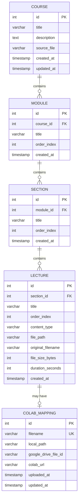

# Design Document: Learning Platform

## Overview

This document describes the technical design for a fullstack learning platform similar to Udemy. The platform enables users to browse courses, navigate structured content (semesters → modules → sections → lectures), and consume various media types including MP4 video, PDF, DOCX (rendered as HTML), TXT (rendered as HTML), and IPython Notebooks (redirected to Google Colab).

The system is built with FastAPI (Python) on the backend, React (TypeScript) on the frontend, PostgreSQL for persistence, and Docker Compose for orchestration. Course structures are bootstrapped by parsing directory tree files (`applied_diploma_ai_ml.txt` and `applied_roots.txt`) that define hierarchical content layouts. A Colab integration layer maps `.ipynb` files to their Google Colab URLs via a helper script and database table.

The architecture prioritizes modularity, readability, and fault tolerance with clear separation between the tree-parsing ingestion pipeline, the REST API layer, and the React content viewer.

## Architecture

### High-Level System Architecture



### Request Flow



### Docker Compose Services



## Components and Interfaces

### Component 1: Tree Parser Service

**Purpose**: Parses directory tree text files to extract hierarchical course structure and seeds the database.

**Interface**:
```python
from dataclasses import dataclass
from enum import Enum

class ContentType(str, Enum):
    VIDEO = "mp4"
    PDF = "pdf"
    NOTEBOOK = "ipynb"
    HTML = "html"
    DOCX = "docx"
    TXT = "txt"
    AUDIO = "mp3"
    ARCHIVE = "zip"
    IMAGE = "png"
    PRESENTATION = "pptx"

@dataclass
class ParsedNode:
    name: str
    path: str
    depth: int
    content_type: ContentType | None  # None for directories
    children: list["ParsedNode"]

class TreeParserService:
    def parse_tree_file(self, file_path: str) -> ParsedNode:
        """Parse a directory tree text file into a hierarchical structure."""
        ...

    def detect_content_type(self, filename: str) -> ContentType | None:
        """Determine content type from file extension."""
        ...

    def seed_database(self, course_name: str, root_node: ParsedNode) -> None:
        """Persist parsed tree structure into database tables."""
        ...
```

**Responsibilities**:
- Read and parse indented directory tree text files
- Extract hierarchy levels (course → semester/module → section → lecture)
- Detect content types from file extensions
- Map tree depth to database hierarchy (course, module, section, lecture)
- Seed PostgreSQL with structured course data

### Component 2: Content API (FastAPI)

**Purpose**: Serves course data, content trees, and media files to the frontend.

**Interface**:
```python
from fastapi import FastAPI, HTTPException
from pydantic import BaseModel

class CourseResponse(BaseModel):
    id: int
    title: str
    description: str | None
    module_count: int
    lecture_count: int

class ModuleResponse(BaseModel):
    id: int
    title: str
    order: int
    sections: list["SectionResponse"]

class SectionResponse(BaseModel):
    id: int
    title: str
    order: int
    lectures: list["LectureResponse"]

class LectureResponse(BaseModel):
    id: int
    title: str
    order: int
    content_type: str
    file_path: str | None
    colab_url: str | None
    duration_seconds: int | None

# API Endpoints
# GET  /api/courses                    -> list[CourseResponse]
# GET  /api/courses/{course_id}        -> CourseResponse with full tree
# GET  /api/courses/{course_id}/modules -> list[ModuleResponse]
# GET  /api/lectures/{lecture_id}       -> LectureResponse
# GET  /api/lectures/{lecture_id}/content -> FileResponse | RedirectResponse | HTMLResponse
```

**Responsibilities**:
- Serve paginated course listings
- Provide hierarchical course content (modules → sections → lectures)
- Stream media files (mp4, pdf) from the file system
- Render DOCX and TXT content as HTML
- Redirect `.ipynb` requests to mapped Colab URLs
- Handle errors gracefully with proper HTTP status codes

### Component 3: Content Viewer (React Frontend)

**Purpose**: Renders the course browsing UI and content viewer supporting multiple media types.

**Interface**:
```typescript
// Core page components
interface CourseListPageProps {}
interface CourseDetailPageProps { courseId: number }
interface LectureViewerProps { lectureId: number }

// Content viewer components by type
interface VideoPlayerProps { src: string; title: string }
interface PdfViewerProps { src: string; title: string }
interface HtmlContentProps { html: string; title: string }
interface ColabRedirectProps { colabUrl: string; title: string }

// API client
interface ApiClient {
  getCourses(): Promise<Course[]>;
  getCourseDetail(courseId: number): Promise<CourseDetail>;
  getLectureContent(lectureId: number): Promise<LectureContent>;
}
```

**Responsibilities**:
- Display course catalog with module/lecture counts
- Render hierarchical course navigation (sidebar tree)
- Play MP4 video using HTML5 `<video>` element
- Display PDFs using embedded `<iframe>` or pdf.js
- Render DOCX/TXT content as HTML in a styled container
- Redirect users to Google Colab for `.ipynb` files
- Show loading states and error boundaries

### Component 4: Colab Integration Service

**Purpose**: Maps `.ipynb` files to their Google Colab URLs and provides a helper script to upload notebooks.

**Interface**:
```python
@dataclass
class ColabMapping:
    id: int
    filename: str
    local_path: str
    google_drive_file_id: str
    colab_url: str
    uploaded_at: datetime

class ColabIntegrationService:
    def get_colab_url(self, filename: str) -> str | None:
        """Look up Colab URL for a given notebook filename."""
        ...

    def upload_and_map(self, local_path: str) -> ColabMapping:
        """Upload notebook to Google Drive, generate Colab link, store mapping."""
        ...

    def batch_upload(self, directory: str) -> list[ColabMapping]:
        """Upload all .ipynb files in a directory and map them."""
        ...
```

**Responsibilities**:
- Maintain a mapping table between local `.ipynb` filenames and Colab URLs
- Provide CLI helper script for batch uploading notebooks to Google Drive
- Generate Colab URLs from Google Drive file IDs
- Support manual URL mapping for pre-existing Colab links

## Data Models

### Entity Relationship Diagram



### Database Schema (PostgreSQL DDL)

```sql
CREATE TABLE courses (
    id SERIAL PRIMARY KEY,
    title VARCHAR(500) NOT NULL,
    description TEXT,
    source_file VARCHAR(255) NOT NULL,
    created_at TIMESTAMP WITH TIME ZONE DEFAULT NOW(),
    updated_at TIMESTAMP WITH TIME ZONE DEFAULT NOW()
);

CREATE TABLE modules (
    id SERIAL PRIMARY KEY,
    course_id INTEGER NOT NULL REFERENCES courses(id) ON DELETE CASCADE,
    title VARCHAR(500) NOT NULL,
    order_index INTEGER NOT NULL DEFAULT 0,
    created_at TIMESTAMP WITH TIME ZONE DEFAULT NOW(),
    UNIQUE(course_id, order_index)
);

CREATE TABLE sections (
    id SERIAL PRIMARY KEY,
    module_id INTEGER NOT NULL REFERENCES modules(id) ON DELETE CASCADE,
    title VARCHAR(500) NOT NULL,
    order_index INTEGER NOT NULL DEFAULT 0,
    created_at TIMESTAMP WITH TIME ZONE DEFAULT NOW(),
    UNIQUE(module_id, order_index)
);

CREATE TABLE lectures (
    id SERIAL PRIMARY KEY,
    section_id INTEGER NOT NULL REFERENCES sections(id) ON DELETE CASCADE,
    title VARCHAR(500) NOT NULL,
    order_index INTEGER NOT NULL DEFAULT 0,
    content_type VARCHAR(20) NOT NULL,
    file_path VARCHAR(1000),
    original_filename VARCHAR(500),
    file_size_bytes BIGINT,
    duration_seconds INTEGER,
    created_at TIMESTAMP WITH TIME ZONE DEFAULT NOW(),
    UNIQUE(section_id, order_index)
);

CREATE INDEX idx_lectures_content_type ON lectures(content_type);
CREATE INDEX idx_lectures_section_id ON lectures(section_id);

CREATE TABLE colab_mappings (
    id SERIAL PRIMARY KEY,
    filename VARCHAR(500) NOT NULL UNIQUE,
    local_path VARCHAR(1000) NOT NULL,
    google_drive_file_id VARCHAR(255),
    colab_url VARCHAR(1000),
    uploaded_at TIMESTAMP WITH TIME ZONE,
    updated_at TIMESTAMP WITH TIME ZONE DEFAULT NOW()
);

CREATE INDEX idx_colab_mappings_filename ON colab_mappings(filename);
```

**Validation Rules**:
- `content_type` must be one of: mp4, pdf, ipynb, html, docx, txt, mp3, zip, png, pptx
- `order_index` must be >= 0
- `file_path` is relative to the media volume root
- `colab_url` format: `https://colab.research.google.com/drive/{file_id}`

## Key Functions with Formal Specifications

### Function 1: parse_tree_file()

```python
def parse_tree_file(self, file_path: str) -> ParsedNode:
    """
    Parse a directory tree text file (output of `tree` command) into
    a hierarchical ParsedNode structure.
    """
```

**Preconditions:**
- `file_path` exists and is readable
- File content uses UTF-8 encoding
- Tree uses standard box-drawing characters (├──, └──, │) or spaces for indentation

**Postconditions:**
- Returns a root `ParsedNode` with `depth=0`
- All leaf nodes have a non-None `content_type` if they have a file extension
- Directory nodes have `content_type = None`
- `children` lists preserve the original ordering from the file
- Every node's `path` contains its full relative path from root

**Loop Invariants:**
- At each iteration, `current_depth` correctly reflects the nesting level of the current line
- The stack of parent nodes maintains proper parent-child relationships

### Function 2: detect_content_type()

```python
def detect_content_type(self, filename: str) -> ContentType | None:
    """
    Determine the content type of a file based on its extension.
    Returns None for directories or unknown extensions.
    """
```

**Preconditions:**
- `filename` is a non-empty string

**Postconditions:**
- Returns the correct `ContentType` enum value for known extensions
- Returns `None` for directories (no extension) or unrecognized extensions
- Detection is case-insensitive (`.PDF` == `.pdf`)

### Function 3: resolve_lecture_content()

```python
async def resolve_lecture_content(
    self, lecture_id: int
) -> FileResponse | RedirectResponse | HTMLResponse:
    """
    Resolve and serve lecture content based on its type.
    """
```

**Preconditions:**
- `lecture_id` exists in the database
- For file-based content, `file_path` points to an existing file on the media volume

**Postconditions:**
- For `mp4`: Returns a streaming `FileResponse` with `Content-Type: video/mp4`
- For `pdf`: Returns a `FileResponse` with `Content-Type: application/pdf`
- For `ipynb`: Returns a `RedirectResponse` (307) to the mapped Colab URL
- For `docx`: Returns an `HTMLResponse` with the document rendered as HTML
- For `txt/html`: Returns an `HTMLResponse` with content wrapped in a styled template
- If file not found: Returns HTTP 404
- If Colab mapping missing for ipynb: Returns HTTP 404 with descriptive message

### Function 4: map_tree_to_hierarchy()

```python
def map_tree_to_hierarchy(self, root: ParsedNode, course_name: str) -> Course:
    """
    Map a parsed tree structure to the database hierarchy:
    depth 0 = course root (ignored)
    depth 1 = module (semester/topic group)
    depth 2 = section (chapter within module)
    depth 3+ = lecture (leaf content items)
    """
```

**Preconditions:**
- `root` is a valid `ParsedNode` tree with at least one level of children
- `course_name` is a non-empty string

**Postconditions:**
- Creates exactly one `Course` record
- All depth-1 nodes become `Module` records with sequential `order_index`
- All depth-2 nodes become `Section` records with sequential `order_index`
- All leaf nodes at depth 3+ become `Lecture` records
- Non-leaf nodes at depth 3+ are flattened into the parent section
- `order_index` values are 0-based and sequential within each parent

## Algorithmic Pseudocode

### Tree Parsing Algorithm

```python
def parse_tree_file(self, file_path: str) -> ParsedNode:
    """
    ALGORITHM: Parse directory tree text file
    INPUT: file_path - path to tree text file
    OUTPUT: root ParsedNode with complete hierarchy
    """
    lines = read_file_lines(file_path)
    root = ParsedNode(name="root", path=".", depth=0, content_type=None, children=[])
    
    # Stack tracks (node, depth) for building parent-child relationships
    stack: list[tuple[ParsedNode, int]] = [(root, -1)]
    
    for line in lines:
        if is_empty_or_root(line):
            continue
        
        # Calculate depth from leading whitespace/tree characters
        depth = calculate_depth(line)
        name = extract_name(line)
        path = extract_path(line)
        content_type = self.detect_content_type(name)
        
        node = ParsedNode(
            name=name,
            path=path,
            depth=depth,
            content_type=content_type,
            children=[]
        )
        
        # INVARIANT: stack[-1] is always the closest ancestor of the current node
        # Pop nodes from stack until we find the parent (depth < current depth)
        while stack and stack[-1][1] >= depth:
            stack.pop()
        
        # The top of stack is now the parent
        parent = stack[-1][0]
        parent.children.append(node)
        
        # Push current node as potential parent for subsequent nodes
        stack.append((node, depth))
    
    return root


def calculate_depth(line: str) -> int:
    """
    Count tree-drawing characters to determine nesting depth.
    Each level uses 4 characters: "│   " or "├── " or "└── " or "    "
    """
    stripped = line.rstrip()
    content_start = 0
    depth = 0
    
    i = 0
    while i < len(stripped):
        if stripped[i] in ("│", "├", "└", " "):
            # Each indent unit is ~4 chars
            depth += 1
            i += 4
        else:
            break
    
    return depth


def detect_content_type(self, filename: str) -> ContentType | None:
    """Map file extension to ContentType enum."""
    EXTENSION_MAP = {
        ".mp4": ContentType.VIDEO,
        ".pdf": ContentType.PDF,
        ".ipynb": ContentType.NOTEBOOK,
        ".html": ContentType.HTML,
        ".docx": ContentType.DOCX,
        ".txt": ContentType.TXT,
        ".mp3": ContentType.AUDIO,
        ".zip": ContentType.ARCHIVE,
        ".png": ContentType.IMAGE,
        ".pptx": ContentType.PRESENTATION,
    }
    
    ext = get_extension(filename).lower()
    return EXTENSION_MAP.get(ext, None)
```

### Content Resolution Algorithm

```python
async def resolve_lecture_content(self, lecture_id: int):
    """
    ALGORITHM: Resolve and serve lecture content
    INPUT: lecture_id - database ID of the lecture
    OUTPUT: Appropriate HTTP response based on content type
    
    PRECONDITION: lecture_id exists in DB
    POSTCONDITION: Returns correct response type or raises HTTPException
    """
    lecture = await db.get_lecture(lecture_id)
    
    if lecture is None:
        raise HTTPException(status_code=404, detail="Lecture not found")
    
    match lecture.content_type:
        case ContentType.VIDEO | ContentType.PDF | ContentType.AUDIO:
            # Stream binary file directly
            full_path = media_root / lecture.file_path
            if not full_path.exists():
                raise HTTPException(status_code=404, detail="Media file not found")
            
            media_type = MIME_TYPES[lecture.content_type]
            return FileResponse(full_path, media_type=media_type)
        
        case ContentType.NOTEBOOK:
            # Redirect to Google Colab
            mapping = await db.get_colab_mapping(lecture.original_filename)
            if mapping is None or mapping.colab_url is None:
                raise HTTPException(
                    status_code=404,
                    detail="Colab URL not configured for this notebook"
                )
            return RedirectResponse(url=mapping.colab_url, status_code=307)
        
        case ContentType.DOCX:
            # Convert DOCX to HTML and serve
            full_path = media_root / lecture.file_path
            if not full_path.exists():
                raise HTTPException(status_code=404, detail="File not found")
            
            html_content = convert_docx_to_html(full_path)
            return HTMLResponse(content=wrap_in_template(html_content))
        
        case ContentType.TXT | ContentType.HTML:
            # Read text/HTML and serve in styled template
            full_path = media_root / lecture.file_path
            if not full_path.exists():
                raise HTTPException(status_code=404, detail="File not found")
            
            content = full_path.read_text(encoding="utf-8")
            if lecture.content_type == ContentType.TXT:
                content = f"<pre>{escape_html(content)}</pre>"
            return HTMLResponse(content=wrap_in_template(content))
        
        case _:
            raise HTTPException(
                status_code=415,
                detail=f"Unsupported content type: {lecture.content_type}"
            )
```

### Database Seeding Algorithm

```python
async def seed_database(self, course_name: str, root_node: ParsedNode) -> None:
    """
    ALGORITHM: Seed database from parsed tree
    INPUT: course_name, root ParsedNode
    OUTPUT: Populated database tables
    
    PRECONDITION: Database is migrated (tables exist)
    POSTCONDITION: All tree nodes mapped to appropriate DB records
    """
    course = await db.create_course(title=course_name, source_file=root_node.path)
    
    for module_idx, module_node in enumerate(root_node.children):
        if module_node.content_type is not None:
            # Top-level file (e.g., brochure PDF) -> create default module + section
            module = await db.create_module(
                course_id=course.id,
                title="Course Materials",
                order_index=0
            )
            section = await db.create_section(
                module_id=module.id,
                title="General",
                order_index=0
            )
            await self._create_lecture(section.id, module_node, 0)
            continue
        
        module = await db.create_module(
            course_id=course.id,
            title=module_node.name,
            order_index=module_idx
        )
        
        for section_idx, section_node in enumerate(module_node.children):
            if section_node.content_type is not None:
                # Direct lecture under module -> create default section
                default_section = await db.get_or_create_section(
                    module_id=module.id,
                    title="Lectures",
                    order_index=0
                )
                await self._create_lecture(
                    default_section.id, section_node, section_idx
                )
                continue
            
            section = await db.create_section(
                module_id=module.id,
                title=section_node.name,
                order_index=section_idx
            )
            
            # Recursively process lectures (depth 3+)
            await self._process_lectures(section.id, section_node.children)


async def _process_lectures(
    self, section_id: int, nodes: list[ParsedNode], start_order: int = 0
) -> None:
    """Recursively flatten nested directories into lectures."""
    order = start_order
    for node in nodes:
        if node.content_type is not None:
            await self._create_lecture(section_id, node, order)
            order += 1
        else:
            # Nested directory - flatten its children into this section
            await self._process_lectures(section_id, node.children, order)
            order += len(self._count_leaves(node))
```

## Example Usage

### Backend: Starting the Application

```python
# backend/main.py
from fastapi import FastAPI
from fastapi.middleware.cors import CORSMiddleware
from contextlib import asynccontextmanager

from app.db import init_db, close_db
from app.routers import courses, lectures
from app.services.tree_parser import TreeParserService
from app.config import settings

@asynccontextmanager
async def lifespan(app: FastAPI):
    await init_db()
    # Seed courses on first run if DB is empty
    parser = TreeParserService()
    await parser.seed_if_empty(
        courses=[
            ("Applied AI Diploma", settings.TREE_FILE_AI_DIPLOMA),
            ("Applied Roots", settings.TREE_FILE_ROOTS),
        ]
    )
    yield
    await close_db()

app = FastAPI(title="Learning Platform API", lifespan=lifespan)

app.add_middleware(
    CORSMiddleware,
    allow_origins=[settings.FRONTEND_URL],
    allow_methods=["*"],
    allow_headers=["*"],
)

app.include_router(courses.router, prefix="/api")
app.include_router(lectures.router, prefix="/api")
```

### Frontend: Course Content Viewer

```typescript
// frontend/src/pages/CourseDetail.tsx
import { useParams } from "react-router-dom";
import { useCourseDetail } from "../hooks/useCourseDetail";
import { Sidebar } from "../components/Sidebar";
import { ContentViewer } from "../components/ContentViewer";

export function CourseDetail() {
  const { courseId } = useParams<{ courseId: string }>();
  const { course, isLoading, error } = useCourseDetail(Number(courseId));

  if (isLoading) return <LoadingSpinner />;
  if (error) return <ErrorDisplay error={error} />;

  return (
    <div className="flex h-screen">
      <Sidebar modules={course.modules} />
      <main className="flex-1 overflow-auto">
        <ContentViewer />
      </main>
    </div>
  );
}

// frontend/src/components/ContentViewer.tsx
import { useActiveLecture } from "../hooks/useActiveLecture";

export function ContentViewer() {
  const { lecture, isLoading } = useActiveLecture();

  if (!lecture) return <WelcomeMessage />;
  if (isLoading) return <LoadingSpinner />;

  switch (lecture.content_type) {
    case "mp4":
      return <VideoPlayer src={`/api/lectures/${lecture.id}/content`} />;
    case "pdf":
      return <PdfViewer src={`/api/lectures/${lecture.id}/content`} />;
    case "ipynb":
      return <ColabRedirect url={lecture.colab_url!} title={lecture.title} />;
    case "docx":
    case "txt":
    case "html":
      return <HtmlContent lectureId={lecture.id} />;
    default:
      return <UnsupportedType type={lecture.content_type} />;
  }
}
```

### Docker Compose Configuration

```yaml
# docker-compose.yml
services:
  frontend:
    build:
      context: ./frontend
      dockerfile: Dockerfile
    ports:
      - "3000:80"
    depends_on:
      - backend
    environment:
      - VITE_API_URL=http://localhost:8000

  backend:
    build:
      context: ./backend
      dockerfile: Dockerfile
    ports:
      - "8000:8000"
    depends_on:
      postgres:
        condition: service_healthy
    env_file:
      - .env
    volumes:
      - ./media:/app/media
      - ./data:/app/data

  postgres:
    image: postgres:16-alpine
    ports:
      - "5432:5432"
    env_file:
      - .env
    volumes:
      - pgdata:/var/lib/postgresql/data
    healthcheck:
      test: ["CMD-SHELL", "pg_isready -U ${POSTGRES_USER}"]
      interval: 5s
      timeout: 5s
      retries: 5

volumes:
  pgdata:
```

### Backend Dockerfile (using uv)

```dockerfile
# backend/Dockerfile
FROM python:3.11-slim AS base

# Install uv
COPY --from=ghcr.io/astral-sh/uv:latest /uv /uvx /bin/

WORKDIR /app

# Copy dependency files first for layer caching
COPY pyproject.toml uv.lock ./

# Install dependencies using uv (frozen ensures lockfile is respected)
RUN uv sync --frozen --no-dev

# Copy application code
COPY . .

EXPOSE 8000

CMD ["uv", "run", "uvicorn", "app.main:app", "--host", "0.0.0.0", "--port", "8000"]
```

### Colab Helper Script

```python
# scripts/upload_notebooks.py
"""
CLI script to upload .ipynb files to Google Drive and update colab_mappings table.

Usage:
    python scripts/upload_notebooks.py --directory ./media/notebooks
    python scripts/upload_notebooks.py --file ./media/notebooks/example.ipynb
"""
import asyncio
import argparse
from pathlib import Path

from app.services.colab_integration import ColabIntegrationService
from app.db import init_db, close_db

async def main():
    parser = argparse.ArgumentParser(description="Upload notebooks to Google Drive")
    parser.add_argument("--directory", type=str, help="Directory containing .ipynb files")
    parser.add_argument("--file", type=str, help="Single .ipynb file to upload")
    args = parser.parse_args()

    await init_db()
    service = ColabIntegrationService()

    if args.directory:
        mappings = await service.batch_upload(args.directory)
        print(f"Uploaded {len(mappings)} notebooks")
    elif args.file:
        mapping = await service.upload_and_map(args.file)
        print(f"Uploaded: {mapping.filename} -> {mapping.colab_url}")

    await close_db()

if __name__ == "__main__":
    asyncio.run(main())
```

## Correctness Properties

*A property is a characteristic or behavior that should hold true across all valid executions of a system — essentially, a formal statement about what the system should do. Properties serve as the bridge between human-readable specifications and machine-verifiable correctness guarantees.*

### Property 1: Tree Parsing Completeness

*For any* valid tree text file, the total number of ParsedNodes in the output tree SHALL equal the number of non-empty content lines in the source file. Every non-empty line produces exactly one node; no lines are silently dropped.

**Validates: Requirements 1.1**

### Property 2: Hierarchy Preservation

*For any* pair of lines in a tree file where line B is indented beneath line A, B's ParsedNode SHALL be a descendant of A's ParsedNode in the output tree. The parent-child relationships in the parsed tree mirror the indentation structure of the source.

**Validates: Requirements 1.2**

### Property 3: Sibling Order Preservation

*For any* set of sibling entries at the same depth in a tree file, the parsed children list SHALL maintain the same relative ordering as they appear in the source file. Additionally, after database seeding, order_index values SHALL be sequential starting from 0 with no gaps within each parent.

**Validates: Requirements 1.3, 3.2**

### Property 4: Tree Parsing Round Trip

*For any* valid ParsedNode tree, serializing it to tree-file format and then parsing the result SHALL produce an equivalent tree structure (same nodes, same hierarchy, same order).

**Validates: Requirements 1.1, 1.2, 1.3**

### Property 5: Content Type Case Insensitivity

*For any* filename with a recognized extension, `detect_content_type()` SHALL return the same ContentType value regardless of the letter case of the extension. For example, `.PDF`, `.Pdf`, and `.pdf` all yield ContentType.PDF.

**Validates: Requirements 2.2**

### Property 6: Unknown Extensions Return Null

*For any* filename with no extension or an unrecognized extension, `detect_content_type()` SHALL return None. No spurious content type is assigned.

**Validates: Requirements 2.3**

### Property 7: Depth-to-Entity Mapping

*For any* parsed tree structure, seeding SHALL map depth-1 nodes to Module records, depth-2 nodes to Section records, and depth-3+ leaf nodes to Lecture records. Non-leaf nodes at depth 3+ SHALL be flattened, with their children becoming lectures in the parent section.

**Validates: Requirements 3.1, 3.5**

### Property 8: Idempotent Seeding

*For any* tree file, running the seed operation N times (N ≥ 1) SHALL result in exactly one Course record for that source file. `∀ n ∈ ℕ: seed(file, n_times) ⟹ COUNT(courses WHERE source_file=file) == 1`.

**Validates: Requirements 3.3**

### Property 9: Content Resolution Correctness

*For any* lecture with a known content_type and an existing file on the media volume, the Content_Resolver SHALL return the correct response type: streaming FileResponse for mp4/pdf/mp3, HTTP 307 redirect for ipynb (when mapping exists), or HTMLResponse for docx/txt/html. The MIME type in file responses SHALL match the content type.

**Validates: Requirements 5.1, 5.2, 5.4, 5.5**

### Property 10: Path Traversal Prevention

*For any* file path that would resolve outside the configured Media_Volume root (including paths with `../` sequences, symlink escape, or absolute paths), the Content_Resolver SHALL reject the request. No file outside the media root is ever served.

**Validates: Requirements 6.1, 6.2, 6.3**

### Property 11: Colab URL Format Integrity

*For any* Google Drive file ID, the Colab_Integration_Service SHALL generate a URL matching the format `https://colab.research.google.com/drive/{file_id}`. A lecture with content_type ipynb SHALL only redirect when a valid mapping exists; otherwise it returns 404.

**Validates: Requirements 5.2, 5.3, 7.5**

### Property 12: Cascade Delete Integrity

*For any* Course (or Module) record, deleting it SHALL leave zero orphaned Module, Section, or Lecture records that reference the deleted entity. `∀ entity: after DELETE(entity), COUNT(children WHERE parent_id=entity.id) == 0`.

**Validates: Requirements 10.1, 10.2**

### Property 13: Batch Upload Resilience

*For any* batch of notebook files where some uploads fail, the Colab_Integration_Service SHALL successfully process all non-failing files and store their mappings. Already-mapped notebooks SHALL be skipped without re-upload.

**Validates: Requirements 7.3, 7.4, 12.3**

### Property 14: Content Viewer Type Dispatch

*For any* lecture content_type value, the Frontend SHALL render the correct viewer component: VideoPlayer for mp4, PdfViewer for pdf, HtmlContent for docx/txt/html, ColabRedirect for ipynb, and UnsupportedType for unknown types. The mapping from content_type to component is exhaustive and deterministic.

**Validates: Requirements 8.3, 9.1, 9.2, 9.3, 9.4, 9.5**


## Error Handling

### Error Scenario 1: Missing Media File

**Condition**: A lecture record exists in DB but the referenced file is not present on the media volume.
**Response**: Return HTTP 404 with body `{"detail": "Media file not found: {filename}"}`.
**Recovery**: Log the missing file path. The platform continues serving other lectures. An admin can re-upload the file and the lecture becomes accessible without any DB changes.

### Error Scenario 2: Malformed Tree File

**Condition**: The tree text file contains unparseable lines (broken encoding, non-standard tree characters).
**Response**: Skip unparseable lines and log warnings. Continue parsing remaining content.
**Recovery**: The seeder logs all skipped lines with line numbers for manual review. Partial course structure is still usable.

### Error Scenario 3: Database Connection Failure

**Condition**: PostgreSQL is unreachable during API request or seeding.
**Response**: FastAPI returns HTTP 503 (Service Unavailable) with retry-after header.
**Recovery**: Docker Compose healthcheck ensures PostgreSQL is ready before backend starts. Connection pool with retry logic (3 attempts, exponential backoff) handles transient failures.

### Error Scenario 4: DOCX Conversion Failure

**Condition**: A `.docx` file is corrupted or uses unsupported features.
**Response**: Return HTTP 422 with `{"detail": "Unable to render document. The file may be corrupted."}`.
**Recovery**: Log the specific conversion error. Offer a download link as fallback so the user can open the file locally.

### Error Scenario 5: Colab Upload Failure

**Condition**: Google Drive API returns an error during notebook upload (auth failure, quota exceeded).
**Response**: The CLI script reports the error per-file and continues with remaining files.
**Recovery**: Failed uploads are logged. The script can be re-run; it skips already-mapped files.

## Testing Strategy

### Unit Testing Approach

**Library**: pytest + pytest-asyncio

Key test cases:
- Tree parser correctly handles various indentation styles
- Content type detection covers all supported extensions (case-insensitive)
- Tree-to-hierarchy mapping correctly assigns depth levels
- Edge cases: empty tree files, single-file courses, deeply nested structures (5+ levels)
- DOCX-to-HTML conversion produces valid HTML output
- Colab URL generation from Drive file IDs

### Property-Based Testing Approach

**Library**: hypothesis (Python)

Properties to test:
- For any generated tree structure string, parsing and re-serializing produces an equivalent structure
- `detect_content_type` is idempotent: calling it twice on the same input yields the same result
- Order indices are always sequential with no gaps after seeding
- The number of leaf nodes in the parsed tree equals the number of lecture records created in DB

### Integration Testing Approach

- Use Docker Compose test profile with isolated PostgreSQL instance
- Test full request lifecycle: seed → query courses → fetch lecture content
- Verify streaming responses for large media files
- Test CORS headers are correctly set
- Test cascade deletes maintain referential integrity

### End-to-End Testing

**Library**: Playwright (for React frontend)

- Navigate course catalog → click course → browse sidebar → play video
- Verify PDF renders in embedded viewer
- Verify `.ipynb` click opens new tab with Colab URL
- Test responsive layout and error states

## Performance Considerations

1. **Lazy Content Loading**: The frontend fetches the course tree structure (metadata only) upfront, but streams actual media content on-demand when a lecture is selected.

2. **Database Indexing**: Indexes on `lectures.section_id` and `lectures.content_type` optimize the most common queries (fetching lectures by section, filtering by type).

3. **File Streaming**: Large MP4 files are served using FastAPI's `FileResponse` with streaming (supports HTTP Range requests for video seeking).

4. **Connection Pooling**: Use asyncpg with a pool size of 10-20 connections to handle concurrent requests without exhausting DB connections.

5. **Frontend Bundle Splitting**: PDF.js and video player components are lazy-loaded only when needed.

6. **Caching**: Course structure responses (which rarely change) should be cached with appropriate Cache-Control headers or an in-memory cache with TTL.

## Security Considerations

1. **Path Traversal Prevention**: All file paths from the database are validated against the media volume root. Requests attempting to traverse above the root (`../`) are rejected.

2. **Environment Variables**: All secrets (DB credentials, Google API keys) are stored in `.env` (gitignored) and injected via Docker Compose `env_file`.

3. **CORS**: Restrict allowed origins to the frontend domain only.

4. **Input Validation**: All API path parameters and query parameters are validated via Pydantic models with strict types.

5. **SQL Injection**: Use SQLAlchemy ORM or parameterized queries exclusively. No raw string interpolation in queries.

6. **File Upload Limits**: The Colab upload script validates that files are valid `.ipynb` JSON before uploading.

## Dependencies

### Backend (Python 3.11+)

**Package Manager**: `uv` — a fast Python package and project manager. Dependencies are declared in `pyproject.toml` and locked in `uv.lock`.

- `fastapi` - Web framework
- `uvicorn` - ASGI server
- `sqlalchemy[asyncio]` + `asyncpg` - Database ORM and async PostgreSQL driver
- `alembic` - Database migrations
- `python-docx` - DOCX parsing
- `python-multipart` - File upload handling
- `pydantic-settings` - Configuration management
- `google-api-python-client` + `google-auth` - Google Drive API (for Colab upload script)
- `pytest` + `pytest-asyncio` + `hypothesis` - Testing (dev dependencies)
- `httpx` - Async HTTP client for testing (dev dependency)

### Frontend (Node 20+)
- `react` + `react-dom` - UI framework
- `react-router-dom` - Client-side routing
- `@tanstack/react-query` - Data fetching and caching
- `tailwindcss` - Styling
- `vite` - Build tool
- `vitest` + `@testing-library/react` - Testing
- `playwright` - E2E testing

### Infrastructure
- `docker` + `docker-compose` - Containerization
- `uv` - Python package and project manager (replaces pip/requirements.txt)
- `postgres:16-alpine` - Database image
- `nginx` - Frontend static file serving (in production container)

## Project Folder Structure

```
learning-platform/
├── docker-compose.yml
├── .env.example
├── .gitignore
├── data/
│   ├── applied_diploma_ai_ml.txt
│   └── applied_roots.txt
├── media/                          # Mounted volume for media files
│   └── .gitkeep
├── backend/
│   ├── Dockerfile
│   ├── pyproject.toml
│   ├── uv.lock
│   ├── alembic.ini
│   ├── alembic/
│   │   └── versions/
│   ├── app/
│   │   ├── __init__.py
│   │   ├── main.py
│   │   ├── config.py              # Pydantic Settings (reads .env)
│   │   ├── db.py                  # Database connection + session
│   │   ├── models/
│   │   │   ├── __init__.py
│   │   │   ├── course.py
│   │   │   ├── module.py
│   │   │   ├── section.py
│   │   │   ├── lecture.py
│   │   │   └── colab_mapping.py
│   │   ├── schemas/
│   │   │   ├── __init__.py
│   │   │   ├── course.py
│   │   │   ├── lecture.py
│   │   │   └── content.py
│   │   ├── routers/
│   │   │   ├── __init__.py
│   │   │   ├── courses.py
│   │   │   └── lectures.py
│   │   ├── services/
│   │   │   ├── __init__.py
│   │   │   ├── tree_parser.py
│   │   │   ├── content_resolver.py
│   │   │   └── colab_integration.py
│   │   └── utils/
│   │       ├── __init__.py
│   │       ├── docx_renderer.py
│   │       └── path_security.py
│   └── tests/
│       ├── __init__.py
│       ├── conftest.py
│       ├── test_tree_parser.py
│       ├── test_content_resolver.py
│       ├── test_api_courses.py
│       └── test_api_lectures.py
├── frontend/
│   ├── Dockerfile
│   ├── nginx.conf
│   ├── package.json
│   ├── tsconfig.json
│   ├── vite.config.ts
│   ├── tailwind.config.js
│   ├── index.html
│   ├── src/
│   │   ├── main.tsx
│   │   ├── App.tsx
│   │   ├── api/
│   │   │   └── client.ts
│   │   ├── components/
│   │   │   ├── Sidebar.tsx
│   │   │   ├── ContentViewer.tsx
│   │   │   ├── VideoPlayer.tsx
│   │   │   ├── PdfViewer.tsx
│   │   │   ├── HtmlContent.tsx
│   │   │   └── ColabRedirect.tsx
│   │   ├── hooks/
│   │   │   ├── useCourses.ts
│   │   │   ├── useCourseDetail.ts
│   │   │   └── useActiveLecture.ts
│   │   ├── pages/
│   │   │   ├── CourseList.tsx
│   │   │   └── CourseDetail.tsx
│   │   └── types/
│   │       └── index.ts
│   └── tests/
│       └── components/
├── scripts/
│   ├── upload_notebooks.py
│   └── seed_db.py
└── README.md
```
