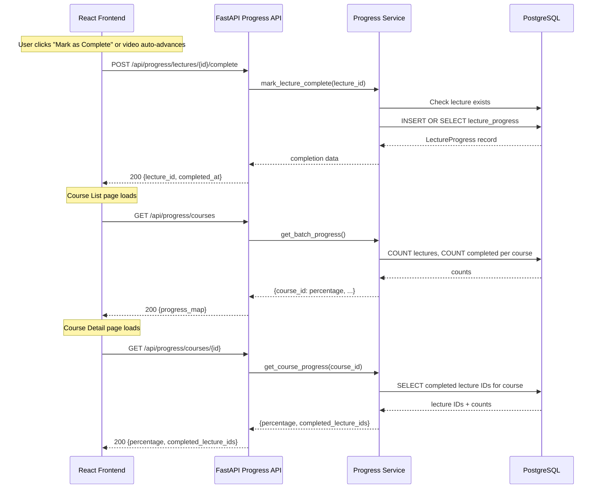
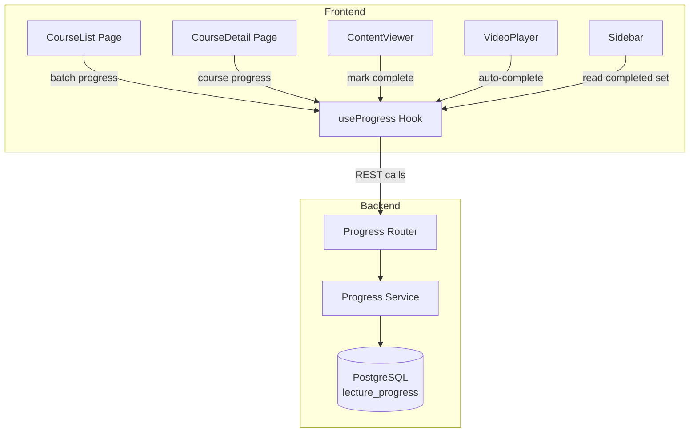
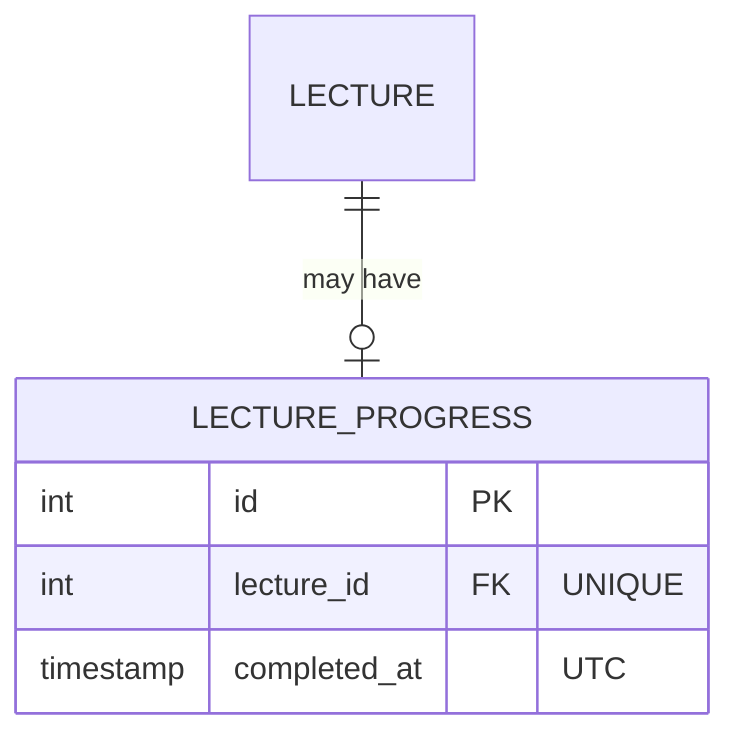

# Design Document: Progress Tracking

## Overview

This feature adds lecture completion tracking to the learning platform. Users can mark lectures as complete manually via a button or automatically when a video ends and the player advances. Progress data persists in PostgreSQL without any user identifier (single-user system). The course list page and course detail page display completion percentages and sidebar checkmarks.

The design adds a new `lecture_progress` table, a progress service, three API endpoints, a React custom hook (`useProgress`), and modifications to existing frontend components (ContentViewer, VideoPlayer, Sidebar, CourseList, CourseDetail).

## Architecture

### Progress Tracking Data Flow



### Component Integration



## Components and Interfaces

### Component 1: Progress Service (Backend)

**Purpose**: Encapsulates all progress business logic — marking lectures complete, calculating percentages, and fetching completion data.

**Interface**:
```python
from datetime import datetime
from dataclasses import dataclass

@dataclass
class LectureCompletionResult:
    lecture_id: int
    completed_at: datetime
    already_existed: bool

@dataclass
class CourseProgressResult:
    course_id: int
    percentage: int  # 0-100
    completed_count: int
    total_count: int
    completed_lecture_ids: list[int]

class ProgressService:
    def __init__(self, session: AsyncSession):
        self.session = session

    async def mark_lecture_complete(self, lecture_id: int) -> LectureCompletionResult:
        """Mark a lecture as completed. Idempotent — returns existing record if already complete."""
        ...

    async def get_course_progress(self, course_id: int) -> CourseProgressResult:
        """Get progress for a single course including the set of completed lecture IDs."""
        ...

    async def get_batch_progress(self) -> dict[int, int]:
        """Get progress percentages for all courses. Returns {course_id: percentage}."""
        ...
```

**Responsibilities**:
- Validate that lecture/course IDs exist before operating
- Insert `lecture_progress` records idempotently (ON CONFLICT DO NOTHING)
- Calculate percentage as `floor(completed / total * 100)`
- Return 0% for courses with zero lectures
- Raise domain exceptions for missing resources (translated to HTTP errors by the router)

### Component 2: Progress Router (Backend)

**Purpose**: Exposes REST endpoints for the frontend to read and write progress data.

**Interface**:
```python
# POST /api/progress/lectures/{lecture_id}/complete
#   -> 200: {lecture_id, completed_at}
#   -> 404: lecture not found
#   -> 503: database unreachable (Retry-After header)

# GET /api/progress/courses/{course_id}
#   -> 200: {course_id, percentage, completed_count, total_count, completed_lecture_ids}
#   -> 404: course not found

# GET /api/progress/courses
#   -> 200: {progress: {course_id: percentage, ...}}
```

**Responsibilities**:
- Parse and validate path parameters
- Delegate to ProgressService
- Handle service exceptions and translate to HTTP status codes
- Add `Retry-After: 30` header on 503 responses

### Component 3: useProgress Hook (Frontend)

**Purpose**: Provides React components with progress data and mutation functions via @tanstack/react-query.

**Interface**:
```typescript
interface UseProgressOptions {
  courseId: number;
}

interface CourseProgress {
  course_id: number;
  percentage: number;
  completed_count: number;
  total_count: number;
  completed_lecture_ids: number[];
}

interface BatchProgress {
  progress: Record<number, number>;
}

// Hook for a specific course's progress (used in CourseDetail)
function useCourseProgress(courseId: number): {
  data: CourseProgress | undefined;
  isLoading: boolean;
  error: Error | null;
};

// Hook for batch progress across all courses (used in CourseList)
function useBatchProgress(): {
  data: BatchProgress | undefined;
  isLoading: boolean;
  error: Error | null;
};

// Mutation hook for marking a lecture complete
function useMarkComplete(): {
  mutate: (lectureId: number) => void;
  isPending: boolean;
  isSuccess: boolean;
  error: Error | null;
};
```

**Responsibilities**:
- Cache progress data using react-query's queryKey mechanism
- Invalidate/update course progress cache after a successful mark-complete mutation
- Provide optimistic updates so the UI responds immediately
- Handle API errors gracefully

### Component 4: Updated ContentViewer

**Purpose**: Adds a "Mark as Complete" / "Completed ✓" button below the content area.

**Changes**:
- Accept `isCompleted` and `onMarkComplete` props
- Render button state: idle → loading → completed
- Disable button while mutation is in-flight or lecture is already complete
- Show inline error toast if the mutation fails

### Component 5: Updated VideoPlayer

**Purpose**: Auto-completes the current lecture when advancing to the next one.

**Changes**:
- Accept an `onAutoComplete` callback prop
- Call `onAutoComplete()` when countdown reaches zero (before calling `onEnded`)
- Call `onAutoComplete()` when "Play now" is clicked (before calling `onEnded`)
- Do NOT call `onAutoComplete()` if countdown is cancelled
- Fire-and-forget: do not block navigation on API response

### Component 6: Updated Sidebar

**Purpose**: Shows checkmark indicators next to completed lectures.

**Changes**:
- Accept a `completedLectureIds: Set<number>` prop
- Render a green checkmark (✓) next to each completed lecture title
- Use subtle styling that doesn't interfere with the active-lecture highlight

## Data Models

### New Table: lecture_progress



### Database Schema (PostgreSQL DDL)

```sql
CREATE TABLE lecture_progress (
    id SERIAL PRIMARY KEY,
    lecture_id INTEGER NOT NULL UNIQUE REFERENCES lectures(id) ON DELETE CASCADE,
    completed_at TIMESTAMP WITH TIME ZONE NOT NULL DEFAULT NOW()
);

CREATE INDEX idx_lecture_progress_lecture_id ON lecture_progress(lecture_id);
```

### SQLAlchemy Model

```python
# backend/app/models/lecture_progress.py
from datetime import datetime
from sqlalchemy import DateTime, ForeignKey, Integer, UniqueConstraint, func, Index
from sqlalchemy.orm import Mapped, mapped_column, relationship
from app.models.course import Base

class LectureProgress(Base):
    """Records that a lecture has been completed."""

    __tablename__ = "lecture_progress"
    __table_args__ = (
        UniqueConstraint("lecture_id", name="uq_lecture_progress_lecture_id"),
        Index("idx_lecture_progress_lecture_id", "lecture_id"),
    )

    id: Mapped[int] = mapped_column(primary_key=True)
    lecture_id: Mapped[int] = mapped_column(
        Integer, ForeignKey("lectures.id", ondelete="CASCADE"), nullable=False, unique=True
    )
    completed_at: Mapped[datetime] = mapped_column(
        DateTime(timezone=True), server_default=func.now(), nullable=False
    )

    # Relationship
    lecture: Mapped["Lecture"] = relationship("Lecture")
```

### Pydantic Schemas

```python
# backend/app/schemas/progress.py
from datetime import datetime
from pydantic import BaseModel

class LectureCompleteResponse(BaseModel):
    lecture_id: int
    completed_at: datetime

class CourseProgressResponse(BaseModel):
    course_id: int
    percentage: int
    completed_count: int
    total_count: int
    completed_lecture_ids: list[int]

class BatchProgressResponse(BaseModel):
    progress: dict[int, int]  # course_id -> percentage
```

### Progress Calculation Query

To compute progress for a single course, the service joins through `modules → sections → lectures` and LEFT JOINs `lecture_progress`:

```sql
SELECT
    COUNT(l.id) AS total_lectures,
    COUNT(lp.id) AS completed_lectures
FROM lectures l
JOIN sections s ON l.section_id = s.id
JOIN modules m ON s.module_id = m.id
WHERE m.course_id = :course_id
LEFT JOIN lecture_progress lp ON lp.lecture_id = l.id;
```

For the batch endpoint, the query groups by `course_id`:

```sql
SELECT
    m.course_id,
    COUNT(l.id) AS total_lectures,
    COUNT(lp.id) AS completed_lectures
FROM lectures l
JOIN sections s ON l.section_id = s.id
JOIN modules m ON s.module_id = m.id
LEFT JOIN lecture_progress lp ON lp.lecture_id = l.id
GROUP BY m.course_id;
```

Percentage: `floor(completed_lectures / total_lectures * 100)` — returns 0 when `total_lectures = 0`.


## Correctness Properties

*A property is a characteristic or behavior that should hold true across all valid executions of a system — essentially, a formal statement about what the system should do. Properties serve as the bridge between human-readable specifications and machine-verifiable correctness guarantees.*

### Property 1: Idempotent Completion

*For any* valid lecture ID, marking that lecture as complete one or more times SHALL always result in exactly one `lecture_progress` record for that lecture, and every call SHALL return the same `lecture_id` and `completed_at` timestamp (the timestamp from the first completion).

**Validates: Requirements 1.1, 1.2, 1.3**

### Property 2: Non-existent Lecture Rejection

*For any* integer that does not correspond to an existing lecture ID in the database, marking it as complete SHALL return a 404 error without creating any `lecture_progress` record.

**Validates: Requirements 1.5**

### Property 3: Progress Percentage Correctness

*For any* pair of non-negative integers (completed, total) where `completed <= total`, the progress calculation SHALL return `floor(completed / total * 100)` when `total > 0`, and `0` when `total == 0`. The result SHALL always be in the range [0, 100] inclusive.

**Validates: Requirements 6.1, 6.2, 6.3**

### Property 4: Course-Isolated Progress

*For any* set of courses with independently marked lectures, the progress reported for each course SHALL count only lectures belonging to that course. Completing a lecture in course A SHALL NOT affect the progress percentage or completed lecture IDs reported for course B.

**Validates: Requirements 4.3, 5.4, 6.4**

## Error Handling

### Backend Error Handling

| Scenario | HTTP Status | Response Body | Notes |
|----------|-------------|---------------|-------|
| Lecture not found (mark complete) | 404 | `{"detail": "Lecture with id {id} not found"}` | Validated via FK check before insert |
| Course not found (get progress) | 404 | `{"detail": "Course with id {id} not found"}` | Validated via existence query |
| Database unreachable | 503 | `{"detail": "Service temporarily unavailable"}` | Includes `Retry-After: 30` header |
| Unexpected server error | 500 | `{"detail": "Internal server error"}` | Logged, not exposed to client |

**Database Error Handling Strategy**:
- The existing `get_session` retry logic (3 attempts with exponential backoff) handles transient connection issues.
- If all retries fail, the progress router catches `OSError` / `OperationalError` and returns 503 with `Retry-After`.
- The unique constraint on `lecture_id` uses `INSERT ... ON CONFLICT DO NOTHING` pattern, so concurrent duplicate requests are safe without explicit locking.

### Frontend Error Handling

| Scenario | Component | Behavior |
|----------|-----------|----------|
| Mark-complete fails | ContentViewer | Re-enable button, show inline error toast |
| Mark-complete fails | VideoPlayer | Ignore error, proceed with navigation (fire-and-forget) |
| Batch progress fails | CourseList | Display 0% for all courses, show subtle error banner |
| Course progress fails | CourseDetail | Show sidebar without checkmarks, show error banner |

**Optimistic Updates**:
- When `useMarkComplete` fires, the local cache is optimistically updated (add lecture ID to completed set, recalculate percentage).
- If the mutation fails, the optimistic update is rolled back via react-query's `onError` callback.

## Testing Strategy

### Property-Based Tests (Backend)

**Library**: [Hypothesis](https://hypothesis.readthedocs.io/) (Python) — already present in the project's test dependencies.

**Configuration**: Minimum 100 examples per property (`@settings(max_examples=100)`).

Each property test is tagged with a comment referencing its design property:
```
# Feature: progress-tracking, Property {N}: {description}
```

**Property tests**:

1. **Idempotent Completion** — Generate random lecture IDs from existing fixtures, call `mark_lecture_complete` 1–5 times, assert only one DB record exists and all responses match.
2. **Non-existent Lecture Rejection** — Generate random integers not in the lectures table, call `mark_lecture_complete`, assert raises 404/LectureNotFoundError.
3. **Progress Percentage Correctness** — Generate random `(completed, total)` pairs with `0 <= completed <= total <= 1000`, call the pure `calculate_percentage` function, assert result matches `floor(completed/total*100)` or 0 for `total=0`, and is in [0, 100].
4. **Course-Isolated Progress** — Generate a random multi-course fixture (2–5 courses, 1–20 lectures each, random completions), call `get_course_progress` for each course, assert each course's count only includes its own lectures.

### Unit Tests (Backend)

- `test_mark_complete_success` — happy path with valid lecture
- `test_mark_complete_returns_existing_on_duplicate` — verify idempotent 200
- `test_mark_complete_404_invalid_lecture` — verify 404
- `test_get_course_progress_zero_lectures` — course with no lectures returns 0%
- `test_get_course_progress_all_complete` — returns 100%
- `test_batch_progress_multiple_courses` — verify all courses in response
- `test_503_on_db_failure` — mock DB failure, verify 503 + Retry-After

### Unit Tests (Frontend)

- ContentViewer: button renders, disables on click, shows "Completed" on success, re-enables on failure
- VideoPlayer: auto-complete fires before `onEnded` on countdown zero and "Play now" click, does NOT fire on cancel
- Sidebar: checkmarks render for completed lectures only
- CourseList: percentage displays correctly, shows 0% on API error
- CourseDetail: progress bar renders, updates reactively after mark-complete

### Integration Tests

- Full flow: POST mark-complete → GET course progress → verify percentage updated
- Concurrent duplicate requests both return 200 without errors
- Application restart retains progress (Docker restart test)
